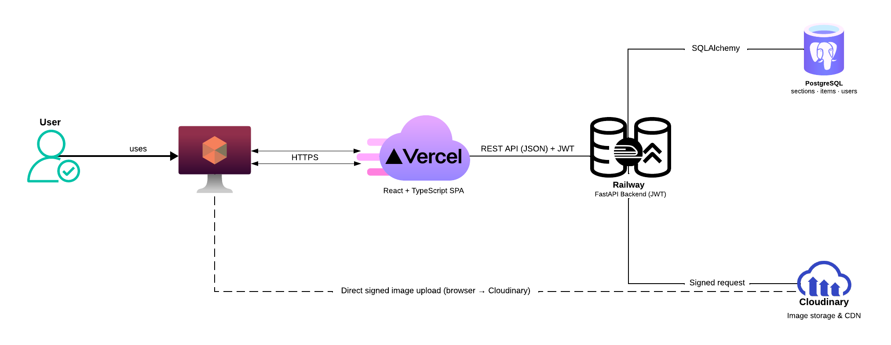

# Pablo Santiago Potes — Portfolio

A personal portfolio built as a **schema-driven content system** rather than a static site: instead of hardcoding education, project, and skill entries into the frontend, the entire content structure — what sections exist, what fields each one has, what layout renders them — is defined at runtime through a custom admin panel and stored in Postgres. Adding a brand-new kind of content (say, publications or speaking engagements) requires zero code changes.

Live at: _add your deployed URL here once live_

---

## Why this exists

Most portfolio templates hardcode their content structure: the education section has exactly the fields a template author decided on, and adding a new kind of section means editing component code. This project inverts that: the **shape of the content is itself data**, stored alongside the content. The result is a small, purpose-built CMS underneath a personal site — built from scratch to understand every layer of the stack, rather than assembled from a page builder.

## Stack

| Layer | Choice | Why |
|---|---|---|
| Frontend | React + TypeScript + Vite | Type safety across the data pipeline, no meta-framework overhead for a client-rendered SPA |
| Styling | Plain CSS (CSS Modules) | No utility framework — a small, deliberate design-token system instead |
| Backend | FastAPI (Python) | Async-capable, Pydantic validation doubles as API documentation |
| Database | PostgreSQL (JSONB columns) | Relational integrity for structure, JSONB flexibility for content |
| Auth | JWT (single admin user) | Right-sized for a one-person content owner, not over-engineered into multi-tenant roles |
| Media | Cloudinary (signed uploads) | Backend never touches image bytes; only brokers upload permission |
| Hosting | Vercel (frontend) + Railway (API + Postgres) | Static frontend and long-running API/DB have different hosting needs |

## Architecture



Two independent deploy targets, one repo: a static frontend build on Vercel, and a long-running FastAPI process + Postgres instance on Railway, talking over a plain REST API.

## The core idea: schema-driven sections

Two tables describe the entire content model:

**`sections`** — the structure of the page (its slug, title, display order, which layout renders it, and a `field_schema`: a JSONB array describing what fields its items have — e.g. `institution`, `degree`, `start_date` for an education entry).

**`section_items`** — the actual content, stored as a `data` JSONB blob whose keys match the parent section's `field_schema`.

```
Section
├─ slug: "education"
├─ layout_variant: "timeline"
├─ field_schema: [{key: "institution", type: "text"}, {key: "degree", type: "text"}, ...]
└─ items:
   ├─ SectionItem { data: {institution: "...", degree: "...", ...} }
   └─ SectionItem { data: {institution: "...", degree: "...", ...} }
```

`field_schema` is validated against `data` on every write (`services/validation.py`) — so the flexibility of JSONB doesn't come at the cost of silently accepting malformed content.

On the frontend, a **layout registry** (`components/sections/registry.ts`) maps each section's `layout_variant` string to the React component that knows how to render it:

```
timeline     → TimelineSection    (education, chronological entries)
grid-cards   → GridCardsSection   (projects, image + tags + link)
pill-groups  → PillGroupsSection  (skills, grouped icon pills)
stacked      → StackedSection     (generic — any field schema, one after another)
```

Four layouts currently cover every section on the live site. Adding a fifth layout is the one case that requires new code (a new React component); adding a new *section* using an existing layout — a "Publications" section using `stacked`, for example — requires none. The admin panel exposes exactly this: a `field_schema` builder for defining a section's shape, and a form generated dynamically from that schema for editing its items — including image and SVG-icon uploads, signed through the backend without ever exposing upload credentials to the browser.

## Admin panel

A JWT-gated `/admin` area, built as routes within the same SPA, not a separate application:

- Dashboard — list sections, toggle visibility, delete
- Section editor — define a section's fields and layout
- Item editor — a form rendered entirely from the parent section's `field_schema`; the same component renders correctly for any section type without knowing what fields it contains

## Design notes

The visual language leans into the engineering/CS subject matter rather than generic template defaults: a terminal-breadcrumb navbar, monospace "code comment" section labels, and a hand-built, mouse-reactive pixel-art canvas background (`components/effects/AquaticScales.tsx`) with distinct light/dark palettes, respecting `prefers-reduced-motion`. Sections that need dense, readable content (Education, Skills) sit on an opaque background; Projects intentionally lets the animated background show through behind frosted-glass cards, as a deliberate second visual beat rather than a uniform treatment everywhere.

## Repository layout

```
frontend/   React + TypeScript + Vite SPA (public site + /admin)
backend/    FastAPI + SQLAlchemy + Alembic + PostgreSQL
```

Each has its own README with local setup instructions.